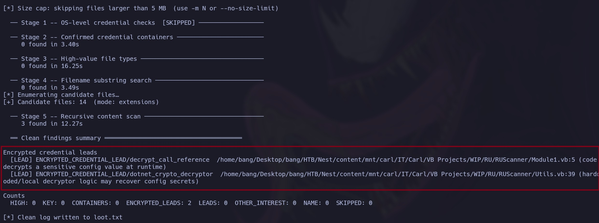
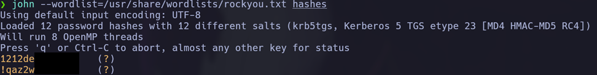

Preparing for the **Certified Penetration Testing Specialist (CPTS)** is not just about completing the Academy path or memorizing a collection of commands.

The exam requires you to connect vulnerabilities, credentials, users, services, and networks as part of a much broader attack chain.

This guide covers a preparation methodology, recommended machines, topics worth reinforcing, and several mistakes you should avoid during the exam.

It does not reveal answers, credentials, or solutions from the exam environment. Its purpose is to help you develop a methodology that you can adapt to whatever scenario you encounter.

---

## How the CPTS works

First, you need to understand what the certification actually evaluates.

The exam is not a collection of isolated vulnerabilities. Instead, you will encounter **different techniques connected through multiple attack chains**.

For example, one vulnerability may give you credentials. Those credentials might let you access another service, compromise a new machine, and uncover information during enumeration that becomes useful much later.

So, instead of thinking:

> “I found the flag. On to the next machine.”

Get used to asking:

> “Which users have I found? What credentials do I have now? Which new services can I test? Which networks or systems can I access?”

That information may become important several steps later.

The key is to understand that **every finding can become the starting point for the next one**.

---

## Do not memorize attacks: practice variations

Do not limit yourself to the command or payload that worked in a lab.

It may sound obvious, but you should practice different variations of the techniques covered in the preparation path.

When you find a vulnerability, do not think only:

> “Which command should I run?”

Ask yourself these questions as well:

> “What capability does this vulnerability give me, and which paths can it open?”

You probably will not encounter the exact same scenario you saw in Academy. What matters is understanding the technique well enough to adapt it when the conditions change.

### Example: LFI

Imagine that, during enumeration, you find a parameter vulnerable to **Local File Inclusion** and confirm that you can read files from the server.

At that point, limiting yourself to common system files or well-known configuration files would be a mistake. You already have a valuable capability, so your next step should be to consider what else you can extract with it.

The application's source code might contain the following:

- Credentials.
- Internal paths.
- Hidden endpoints.
- Sensitive configuration details.
- Logic that leads to the next step in the attack chain.

The source code may not be directly readable, in which case you might need to use wrappers such as `php://filter`.

In another scenario, the same parameter could let you reach internal resources and, when combined with other techniques or tools such as `proxychains`, eventually turn the LFI into code execution.

Even after finding a variation that works, **do not assume that you have reached the limit of the vulnerability**.

The question should be:

> “I have confirmed the LFI. How else can I use this capability, and what new path could it open?”

That is the mindset you should practice for the certification: test variations of the same technique and learn to recognize when one vulnerability can become a bridge to the next part of the chain.

---

## Recommended machines

If you are planning your preparation, these are some Hack The Box machines worth prioritizing.

They will not necessarily replicate exactly what you will encounter on the exam, but they can help you practice techniques and concepts that you should master before attempting it.

The goal is to become comfortable in the following areas:

- SQL injection.
- LFI.
- Credential hunting.
- Password cracking.
- Service enumeration.
- Active Directory.
- Permission abuse.
- Pivoting.
- Privilege escalation.

### Easy

1. **Trick**
2. **ServMon**
3. **Squashed**
4. **Return**
5. **Forest**

### Medium

6. **Union**
7. **Unattended**
8. **Jeeves**
9. **UpDown**
10. **Inception**
11. **Breach**
12. **Authority**
13. **Administrator**
14. **VulnCicada**
15. **Voleur**
16. **TombWatcher**

### Hard

17. **Phoenix**
18. **Vintage**

### Insane

19. **Ghost**

You do not need to complete every machine in order. Use this list to identify the areas where you have the least experience, then choose targets that force you to strengthen those skills.

---

## Credential hunting: what to look for during post-exploitation

Getting a shell and a flag does not mean you are finished.

At that point, another enumeration phase begins inside the compromised system: **credential hunting**.

Look for anything that could provide new leads, including:

- Configuration files.
- Backups.
- SSH keys.
- Encrypted files.
- Saved sessions.
- Command histories.
- Credentials.
- Any other artifact that may become useful later.

A credential-hunting tool can save you a significant amount of work during this phase.

During the exam, I used <a href="https://github.com/NeCr00/Credential-Hunting" target="_blank" rel="noopener noreferrer">
  Credential-Hunting by NeCr00
</a>.

It passively searches the system for files, configurations, and patterns that may contain credentials or sensitive information.

I also created <a href="https://github.com/y0naldez/Credential-Hunting" target="_blank" rel="noopener noreferrer">
  my own fork of Credential-Hunting
</a> based on that tool.

I have added and improved several search patterns to better identify saved sessions, encrypted keys, and other artifacts that can be useful during post-exploitation. I plan to keep updating it as I test it against more machines and lab environments.

### Example output

The following screenshot shows an example of **Credential-Hunting** identifying files that may contain credentials or other information worth investigating.



One point is important: **these tools do not replace specialized utilities**.

On Windows, for example, you may still need tools such as:

- LaZagne.
- Rubeus.
- Mimikatz, when the scenario allows it.
- Utilities designed specifically for session enumeration.

Automation can broaden your search, but you still need to understand what you are looking for and why it might matter.

---

## Pivoting

**Pivoting** is another concept you need to master before starting the exam.

During the exam, I used <a href="https://github.com/nicocha30/ligolo-ng" target="_blank" rel="noopener noreferrer">
  Ligolo-ng
</a>.

It is a practical tool for working with internal networks because it makes routes and tunnels much easier to manage.

However, the tool itself will not help much if you do not understand how access between networks works.

Do not arrive at the exam expecting to learn pivoting as you go. You should already be comfortable with the following scenarios:

- A single pivot.
- Double pivoting.
- Port forwarding.
- Accessing internal networks.
- Routes that cross one or more intermediate hosts.

The underlying scenario is usually the same:

> “We compromised a machine that can reach a network our own host cannot access directly.”

You can practice this on Hack The Box with machines such as:

- **Reddish**.
- **Vault**.
- **Tentacle**.
- **Inception**.

More elaborate pivoting scenarios tend to appear in higher-difficulty machines. They are useful for getting comfortable with complex routes, tunnels, and multiple hops.

Make sure you have practiced this thoroughly. If you reach the exam with doubts about pivoting, you can lose a great deal of time troubleshooting connectivity instead of focusing on enumeration and exploitation.

---

## Active Directory

**Active Directory** is another essential part of your preparation.

It plays a significant role in the overall assessment chain, so you should arrive with a clear methodology for enumeration, permission analysis, and deciding what to do whenever you obtain a new identity.

The following topics will help you build a stronger foundation.

### 1. Domain reconnaissance

Understand the domain before attempting to exploit anything.

At a minimum, identify the following:

- The IP address and network range.
- Users.
- Groups.
- Computers.
- Domain controllers.
- Trust relationships.
- Services.
- Shares.

The goal is to build an initial map of the environment before making decisions.

### 2. RPC enumeration

Do not overlook RPC.

It can reveal users, groups, and other useful information before you obtain a privileged position.

Early enumeration may uncover identities that you can later test against other services or use to expand your understanding of the domain.

### 3. SMB enumeration

Always inspect **shares and their permissions**.

For each share, ask yourself:

- What can I read?
- What can I modify?
- How can I use this access?

Read access may expose credentials, backups, or sensitive configuration files. Write access may let you upload files, modify scripts, or even trigger hash capture.

Whenever you obtain a new account, **enumerate the shares and their permissions again**. The new identity may have access to resources you could not see before.

### 4. LDAP enumeration

LDAP can also provide a great deal of valuable information:

- Users.
- Groups.
- Attributes.
- Services.
- ACLs.
- Relationships between objects.
- Deleted objects.

The goal is not simply to enumerate LDAP. You need to understand **which piece of information could open a new path through the domain**.

### 5. Kerberoasting

Do not memorize only the command used to request tickets. To understand the technique, you need to be clear about the following concepts:

- **What is an SPN?** It is the identifier that associates a service with the account under which it runs. Finding accounts with registered SPNs helps you identify potential Kerberoasting targets.
- **Why can you request a TGS?** Any authenticated domain user can ask Kerberos for a service ticket to access a service with a registered SPN. You do not need to know the service account's password to request that ticket.
- **Which part of the ticket are you trying to crack?** Part of the TGS is encrypted with a key derived from the service account's password. This lets you test password candidates offline until you find one that produces the correct key.
- **What should you do after recovering an account?** Validate the credentials against available services, then enumerate groups, shares, sessions, permissions, and domain relationships again.

Understanding these answers is far more useful than memorizing command syntax. It will allow you to recognize a Kerberoasting opportunity even when the tool, domain, or target account changes.

The technique does not end when you recover the password. Treat the recovered account as a new starting point for enumeration.

### 6. AS-REP Roasting

Before using AS-REP Roasting, understand what it means for an account not to require Kerberos preauthentication, why that configuration exposes encrypted material, and how to identify affected accounts.

As with any new credential, validate where you can use it and what additional access it provides.

### 7. ACEs and ACLs

This is one of the Active Directory areas most worth studying in depth.

During enumeration, you will find different permissions and relationships between objects. Rather than memorizing the name of each permission or associating it directly with a command, focus on understanding **what capability it gives you and which object it applies to**.

For example, do not memorize something like:

> “GenericWrite means running this command.”

Instead, ask:

> “I have GenericWrite, but over which object?”

Having that permission over the following objects does not produce the same result:

- A user.
- A group.
- A computer account.
- A service account.
- Another object in the domain.

The possibilities change completely depending on the object.

You may even have two or more permissions over the same target, but that does not mean they are all equally useful. Depending on the type of object and what you want to achieve, one permission may open a much more valuable path than another.

Active Directory is too broad to learn from a single machine or one attack path.

There is no shortcut: **complete as many Active Directory machines as you can**.

Over time, you will notice that many techniques appear repeatedly, but almost always in different contexts. The relationships, available permissions, and ways in which you need to combine them will change.

Your goal is to adapt to the scenario in front of you instead of depending on a sequence you have already seen.

### Recommended resource: Active Directory notes by ArtesOscuras

To study these topics in greater depth, take a look at the <a href="https://github.com/ArtesOscuras/Notes/tree/main/Active%20Directory" target="_blank" rel="noopener noreferrer">
  Active Directory notes created by ArtesOscuras
</a>.

The repository organizes techniques and abuse paths into dedicated sections covering **Kerberos**, **persistence**, **domain trusts**, **DNS**, **MSSQL**, **gMSA**, and information collection with **BloodHound**, among other topics.

It also contains a dedicated DACL abuse section with notes on permissions and techniques such as:

- `GenericAll`, `GenericWrite`, and `AllExtendedRights`.
- `WriteDACL`, `WriteOwner`, and `WriteSPN`.
- `AddMember` and `AddSelf`.
- `ForceChangePassword`.
- `AddKeyCredentialLink`, also known as *Shadow Credentials*.

Rather than treating the repository as a list of commands, use it as a reference for expanding your own notes. For each technique, document the required permission, the object types it applies to, the expected result, and how to verify that the abuse worked. This gives you a guide you can adapt to the domain context instead of relying on a fixed recipe.

---

## The famous Flag 8

If you search Reddit or other forums for CPTS experiences, you will probably find several references to **the famous Flag 8**.

It can be frustrating because the chain becomes long and forces you to **reassess the domain whenever you obtain a new account**.

That is precisely the point.

A new credential can change the environment from your perspective by:

- Giving you access to a different share.
- Revealing new permissions.
- Enabling WinRM or RDP access.
- Opening a new path in BloodHound.
- Making a previously unavailable technique viable.

At this stage, enumerating once and moving on is not enough.

Every new identity can change what is available to you. If you do not reassess the environment from that account's perspective, it is easy to miss the next step.

For a chain like this, you should know how to combine tools such as:

- NetExec.
- BloodHound.
- PowerView.
- Rubeus.
- LaZagne.
- Certipy.

You will probably use several of them during the same chain.

The central idea is simple:

> **Every new account can unlock the next part of the chain. Do not consider enumeration complete just because you have already performed it once.**

---

## Tips and mistakes to avoid

Technical ability matters, but during a long exam, organization, evidence collection, and time management can make the difference.

These are some of the most important mistakes to avoid.

### 1. Leaving the report until the end

One of the most common mistakes is thinking:

> “I will finish the exam first and document everything afterward.”

The problem is that, by the time you reach the end, you have accumulated too many steps, commands, and pieces of evidence. Reconstructing the entire chain can take a great deal of time.

Maintain a **technical draft as you work**.

You do not need to write directly in SysReptor or worry about making it perfect yet. Simply record what you found, which command you used, what result you obtained, and what you did next.

For example:

#### Domain Enumeration

The Tester executed the following command to enumerate the domain:

```bash
sudo nxc smb <IP> -u '' -p ''
```

**Result:**

```text
[Add the relevant result]
```

```text
[Add screenshot evidence]
```

You can then continue with the next step.

#### Vulnerable File or Service

The Tester identified a vulnerable file or service that allowed access to additional information.

```bash
<COMMAND>
```

**Evidence:**

```text
[Add screenshot evidence]
```

The goal is to let the draft grow alongside your progress.

When it is time to prepare the final report, you will not need to remember how you reached every point. The chain will already be documented, leaving you to organize it, refine the writing, and transfer it to the final template.

### 2. Take more screenshots than you think you need

It is better to finish with extra screenshots than to discover, while writing the report, that you are missing an important piece of evidence.

While solving the exam, it may seem obvious that a particular step worked. Once you begin writing, however, questions start to appear:

> “Do I have evidence that this user actually had that permission?”

> “Did I capture the hash before cracking it?”

> “Do I have evidence of the connection as this user?”

If you do not have that evidence, you may need to return to the environment, reconstruct part of the attack chain, and repeat actions solely to obtain a screenshot.

So, **if you are unsure whether to take a screenshot, take it**.

Remember that passwords, hashes, and other sensitive credentials should be fully or partially redacted. The evidence should demonstrate the finding without exposing complete credentials.

Example:



### 3. Once you have enough points, prioritize the report

Once you obtain **Flag 12**, change your priority.

Until that point, your main objective was to progress through the environment. From then on, the report should become your primary focus.

Earning enough points is only one part of the exam.

You may collect enough flags or even compromise nearly the entire environment, but a poor report can still cause you to fail.

Once you have the required points, begin working seriously on the final version. If you still have time after documenting everything properly, you can return to the remaining flags.

There is also no reason to put unnecessary pressure on yourself:

> **There is absolutely nothing wrong with not obtaining every flag.**

Additional flags do not automatically make you a better penetration tester, and there is no special recognition for completing every part of the environment.

First, make sure you have:

1. The required points.
2. Clear documentation.
3. Sufficient evidence.
4. A solid report.

Then you can go back for anything that remains.

### 4. Organize your notes by machine and attack path

Do not keep all your notes in one enormous, disorganized document.

Use Obsidian, Notion, CherryTree, or whichever tool you prefer, but maintain a clear structure.

The structure I used looked similar to this:

```text
Machines
├── DC01
│   ├── FLAGS
│   └── PATH
│
├── DC02
│   ├── FLAGS
│   └── PATH
│
└── DEV01
    ├── FLAGS
    └── PATH
```

Inside `FLAGS`, I stored the answer and its evidence directly.

For example:

#### 8. Submit the user flag on DC01

```text
AAAABBBCCCDD111
```

```text
Screenshot evidence of the flag
```

Then:

#### 9. Submit the root flag on DC01

```text
AAAABBBCCCDD222
```

```text
Screenshot evidence of the flag
```

Inside `PATH`, on the other hand, I documented the entire process used to compromise that machine.

I wrote it almost as if I were preparing a tutorial:

```text
Enumeration
    ↓
Vulnerability identified
    ↓
Credentials
    ↓
New user
    ↓
Privilege escalation
    ↓
Flag
```

I included commands, important results, explanations, and screenshots.

This helped me tremendously because much of the content was already prepared by the time I started working in SysReptor. In many cases, I only needed to organize the notes, improve the wording, and convert them into a professional report.

### 5. Keep hashes, credentials, and users organized

As you progress, you will accumulate users, passwords, hashes, Kerberos tickets, SSH keys, and accounts from different systems.

If that information is scattered across terminals and loose notes, you will eventually lose something important.

The best approach is to maintain a file or table dedicated exclusively to credentials:

| User | Domain/Host | Password / Hash | Type | Validated against |
|---|---|---|---|---|
| `user1` | `DOMAIN` | `Pass********` | Plaintext | SMB, WinRM |
| `svc_sql` | `DOMAIN` | `$krb5tgs$...` | TGS | Awaiting cracking |
| `Administrator` | `DC01` | `aad3b...` | NTLM | WinRM |

This becomes even more important once you reach Active Directory. A credential that was not useful at first may become valuable later against a machine, service, or resource that you had not yet discovered.

### 6. Enumerate again with every new identity

A new account is not merely another credential to store.

Whenever you obtain a new user, check the following again:

- SMB access.
- WinRM access.
- RDP access.
- SSH access.
- Shares.
- Permissions and ACLs.
- Available sessions.
- New relationships in BloodHound.
- Any service you previously discovered.

The environment has not changed, but **your perspective within it has**.

A resource that was invisible or inaccessible with the previous account may become the next step in the chain.

### 7. Rest

This advice may sound trivial until you have spent too many hours staring at the same terminal:

> **Rest.**

You have **10 days**. This is not a race, and finishing earlier does not make you a better penetration tester.

After being stuck for several hours, you eventually begin repeating commands, overlooking obvious clues, and making mistakes you would not normally make.

Close the terminal. Eat something. Take a nap. Go outside. Exercise. Watch a show.

Do anything that lets your mind stop thinking about the exam for a while.

The key is to find a balance. **You have time, so use it wisely.**

### 8. Keep track of the spawn timer

Do not lose sight of the environment timer.

You will begin with approximately **3,000 minutes**, which may seem like plenty, but it is easy to forget about the timer as you progress through the exam.

In my experience, the extension option became available when the timer dropped below **100 minutes**, and each extension added approximately **200 minutes**.

Check the timer regularly and extend the environment whenever the platform allows it. This will prevent you from losing access and part of your progress because of an oversight.

Do not wait until you are working on a critical step to remember that the environment is about to expire.

---

## Conclusion

You will not pass the CPTS by memorizing a single attack path.

You need to learn how to enumerate, interpret what you find, adapt techniques, and reassess the environment whenever you obtain a new identity or level of access.

The main points from this guide can be summarized as follows:

- Understand techniques instead of memorizing commands.
- Practice variations and complete attack chains.
- Master pivoting before the exam.
- Study Active Directory in depth.
- Document your work as you progress.
- Collect more evidence than you think you will need.
- Prioritize a strong report once you have enough points.

Obtaining a flag proves that you found a path.

Being able to explain that path, reproduce it, and document its impact proves that you understood the assessment.
